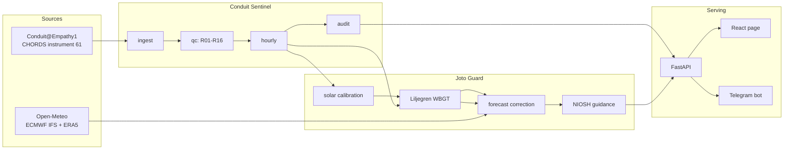
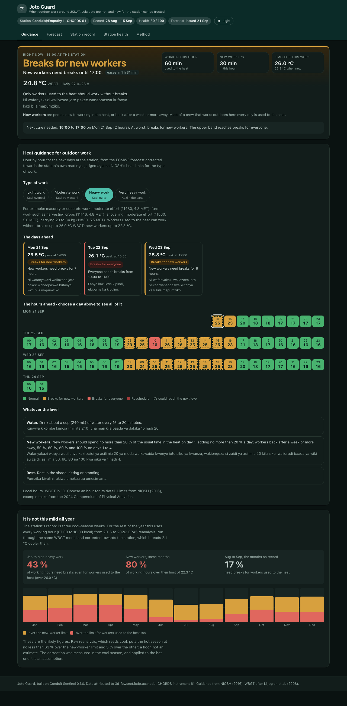
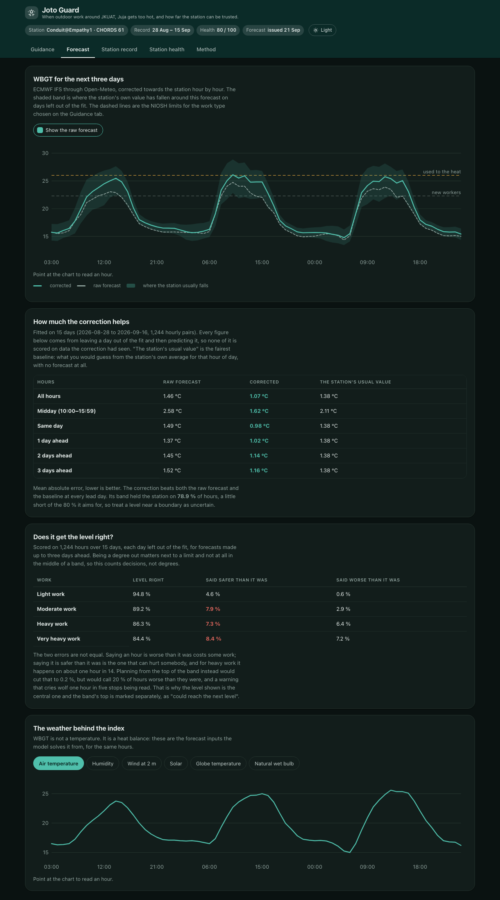
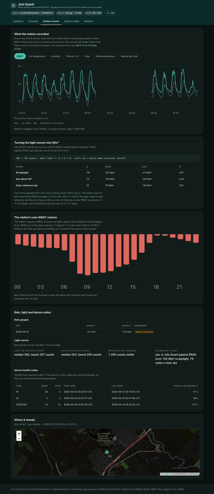
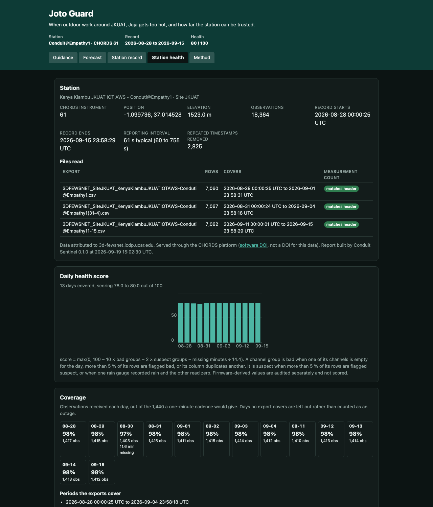
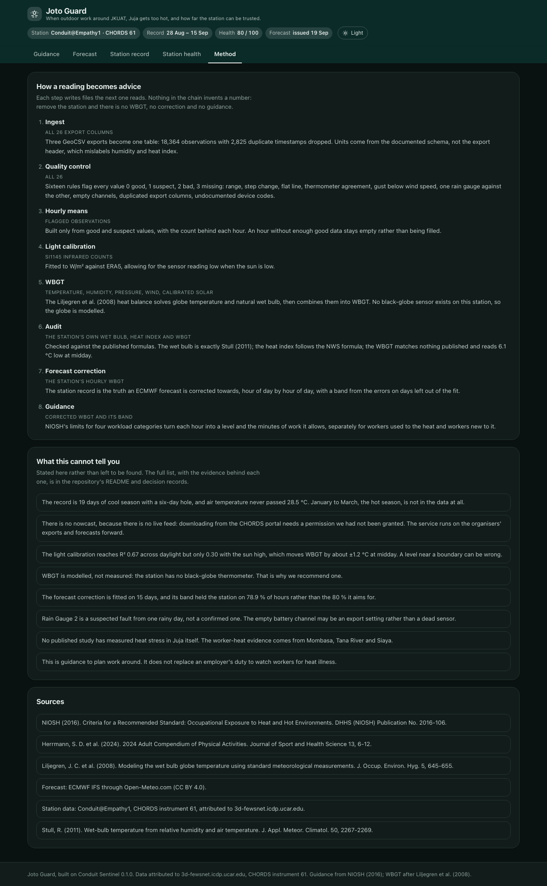

# Joto Guard

> Hack The Weather 2026 entry built on the Conduit@Empathy1 weather station at JKUAT, Juja, Kenya.

All development for this submission took place from 17 to 21 September 2026. The commit history is the record.

## 1. Project name

**Joto Guard** (*joto* is Kiswahili for heat).

> Hour by hour, which outdoor work is safe around Juja, from the Conduit@Empathy1 station's own sensors, after we found the heat-stress index it publishes could not be used to warn anyone, and rebuilt it.

## 2. Problem statement

Heat already costs Kenya's outdoor workers. In 2024, heat exposure cost the country 1.1 billion potential labour hours, a record 51 hours per person, and 74 % of the loss was in agriculture (Lancet Countdown 2025 data sheet for Kenya).

Around Juja, where the Conduit@Empathy1 station stands, much of the work is heavy and outdoors. Quarrying building stone is one of the municipality's most significant economic activities, fed by a construction boom, alongside farming (Juja Municipality Integrated Development Plan 2023–2028).

Kenya Met's heat advisories give temperatures for whole counties with general advice. They do not say when a given kind of work should slow down.

The station itself reports a wet bulb globe temperature (WBGT), the index occupational heat limits are written in. But its firmware value behaves as if the sun were not shining: at midday it reads about 6 °C below a standards-based estimate from the same sensors, so it could not be used to warn anyone.

The evidence, its sources and its limits (we found no published heat study for Juja itself, and our station record covers only three cool-season weeks) are in [`docs/PROBLEM_EVIDENCE.md`](docs/PROBLEM_EVIDENCE.md).

## 3. Solution

Joto Guard answers one question: **for the next three days, hour by hour, can this kind of outdoor work go on?**

It answers in the index occupational heat limits are actually written in, the wet bulb globe temperature (WBGT), which combines heat, humidity, wind and sun. For each hour and each of four workloads it gives a level, the minutes of work that hour allows, and what to do:

| Level | Meaning |
|---|---|
| Normal | Work as usual, new workers included. |
| Acclimatized only | Workers used to the heat can work through; new workers need breaks. |
| Work/rest | Work in spells, resting in the shade. The hour's allowed minutes are given. |
| Reschedule | Too hot for this work; move it to a cooler hour. |

A foreman starting a concrete pour, a farm supervisor planning a harvest day, or a community health team planning household visits sees the answer for the whole day at once. On 20 September 2026, for example, heavy work runs normally until 14:00, needs work-and-rest spells from 14:00 to 15:00, and is normal again after that. Every level is shown in English and Kiswahili.

Three things make the answer worth trusting, and all three come from the station:

1. **The station's own heat-stress index is wrong, and we show it.** Its firmware WBGT column reads **6.1 °C below** a standards-grade value between 10:00 and 15:59. It behaves as if the sun were not shining. Nobody could have been warned with it. We rebuilt WBGT with the Liljegren et al. (2008) model from the station's own temperature, humidity, pressure, wind and light sensors.
2. **Every number passes quality control first.** Sixteen rules flag every reading before it is used, and the Station Health Report publishes what they found, including five faults we are reporting back to JHUB.
3. **The forecast is corrected towards the station.** A raw ECMWF forecast runs about 2 °C cool at midday here. Corrected against the station's own record it is right to 1.07 °C on days it never saw, and it carries an uncertainty band.

## 4. How Conduit@Empathy data is used

Conduit data is not the illustration here; it is the input, the reference and the check. Remove it and nothing downstream exists: there is no WBGT, no correction to apply to the forecast, and no guidance.

| Step | Conduit variables used | What happens |
|---|---|---|
| **Ingest** | all 26 export columns | Three GeoCSV exports parsed to one table: 18,364 observations, 2,825 duplicate timestamps dropped, 28 Aug to 15 Sep 2026. Units are taken from the documented schema, not the export header, which mislabels humidity and heat index. |
| **Quality control** | all 26 | Sixteen rules (R01–R16) flag each value 0 good, 1 suspect, 2 bad, 3 missing: plausible range, site-specific pressure range for 1,523 m, step change, flat line, three-thermometer agreement, gust below wind speed, rain gauge against rain gauge, empty channel, duplicated export column, undocumented device code. Every flag is published with the rule that fired. |
| **Aggregation** | flagged observations | Hourly means built **only** from good and suspect values, with the count behind each hour. Hours without enough good data are left empty rather than filled. |
| **Light calibration** | `light_ir_counts` | The SI1145 reports raw counts, which no heat model can use. Fitted to W/m² against ERA5 as `GHI = (IR − 253) × (a + b(1 − μ))`, μ being the hour's mean cosine of the solar zenith. Held-out R² 0.67 over daylight, 0.91 under a clear reference sky. |
| **WBGT model** | `t_sht_c`, `rh_pct`, `p_station_hpa`, `wind_speed_ms`, calibrated `light_ir_counts` | The Liljegren et al. (2008) heat-balance model solves globe temperature and natural wet bulb from those five station measurements, giving WBGT for 312 of the record's 456 hours. Peak 28.5 °C on 14 Sep at 12:00. |
| **Audit of the station's own columns** | `wet_bulb_fw_c`, `heat_index_fw_c`, `wbgt_fw_c` | Checked against the published formulas. The wet bulb is exactly Stull (2011), mean absolute difference 0.03 °C. The heat index follows the NWS formula. The WBGT matches no published formula and sits 6.1 °C below the model at midday, which is the finding the project is built on. |
| **Forecast correction** | the station's hourly WBGT | The station record *is* the truth the forecast is corrected towards: a per-local-hour offset and an uncertainty band fitted on 15 days of archived ECMWF forecasts against station WBGT, scored by leaving each day out. |
| **Guidance** | corrected WBGT and its band | NIOSH's limits for the four workload categories turn each hour into a level and the minutes of work it allows, for acclimatized and for new workers. The band gives the "could reach the next level" warning. |
| **Outputs** | everything above | The API, the web page and the Telegram bot all read these same files, so they cannot disagree. Every quality-controlled table is downloadable from `/v1/dataset/…`. |

The station is also the subject of the **Station Health Report**, which publishes its uptime, sensor-by-sensor status, thermometer agreement, rain-gauge cross-check, light-sensor calibration and derived-column audit, and ends with five specific repairs for JHUB.

## 5. Features

The dashboard has five tabs, each linkable (`#guidance`, `#forecast`, `#station`, `#health`, `#method`).

**Guidance**, the product.

- **Right now**: the current hour's level, its WBGT with the band, and the minutes of work the hour allows for workers used to the heat and for new workers, with the next spell needing care.
- **Heat guidance for the next three days**, hour by hour, for light, moderate, heavy and very heavy work. Choose a day to see all of it, choose an hour for its detail.
- **English and Kiswahili** for every level and every piece of advice.
- **An uncertainty band** on every forecast hour, and a "could reach the next level" marker when the upper band crosses into a stricter level.

**Forecast**, the three days in full.

- The corrected WBGT as a chart with its band, the raw forecast beside it, and the NIOSH limits for the chosen work type drawn across it. Point anywhere to read the hour.
- **How much the correction helps**: mean absolute error for the raw forecast, the corrected forecast and a climatological baseline, for all hours, for midday, and at each lead day. Corrected beats both everywhere: 1.07 °C against 1.46 raw and 1.38 baseline.
- **The weather behind the index**: the forecast air temperature, humidity, wind, solar, globe temperature and natural wet bulb the model solves WBGT from.

**Station record**, what the instrument actually measured.

- Every hour of the record as a chart, switchable between WBGT, air temperature, humidity, wind, solar, globe temperature and natural wet bulb. The WBGT view draws the station's own column beneath ours, so the 6.1 °C midday gap is visible directly. Gaps in the record break the line rather than being joined across.
- The light-sensor calibration with its held-out scores, stated plainly as the weakest link.
- The firmware WBGT gap by hour of day, the rain gauges, and the device codes.

**Station health**: coverage calendar, daily health score, sensor-group status, three-thermometer agreement, an audit of the station's own calculated columns, five repairs recommended to JHUB, and every table as a download.

**Method**: how a reading becomes advice, step by step, what the service cannot tell you, and the sources.

Throughout:
- **A Telegram bot** that answers `/now`, `/today` and `/tomorrow`, and, once someone sends
  `/subscribe`, **sends without being asked**: the day ahead each morning at 06:30, and a
  warning when the next 24 hours contain work that has to stop or slow down. At most one
  warning a day unless the forecast worsens.
- **An open API** with interactive documentation and every quality-controlled table downloadable as CSV.
- **Light and dark**, and a layout that works on a phone, which is what a supervisor checks at dawn.
- **One command to run all of it**: `docker compose up --build`.

## 6. Technology stack

| Part | Built with |
|---|---|
| Pipeline and models | Python 3.11+, pandas, NumPy, PyYAML |
| Physics | Liljegren et al. (2008) WBGT, implemented in `src/joto_guard/wbgt.py` |
| API | FastAPI, Uvicorn |
| Web | React 19, Vite, Leaflet. Charts are hand-drawn SVG with pointer tracking, so there is no chart library to pull in |
| Bot | python-telegram-bot, httpx |
| Tests and lint | pytest (352 tests), ruff, GitHub Actions |
| Packaging | Docker, Docker Compose; Render for the API, Vercel for the page |
| External data | Open-Meteo (ECMWF IFS forecast, ERA5 archive) |

No database: the pipelines write CSV and JSON, and the API re-reads them whenever they change, so re-running the pipeline refreshes the service without a restart.

## 7. Architecture



Three stages, each writing files the next one reads. **Conduit Sentinel** turns the raw exports into quality-controlled observations, hourly means and a station health report; it knows nothing about heat stress. **Joto Guard** calibrates the light sensor, computes WBGT from the station's sensors, corrects the forecast towards that series and applies the NIOSH limits. **Serving** is a thin layer: the API re-reads those files, and the page and the bot both read the API, so none of the three can show a different number. The source of the diagram is in [`docs/architecture/pipeline.mmd`](docs/architecture/pipeline.mmd).

## 8. Installation and setup

The station exports are in the repository, so nothing below needs a portal account or an API key.

**With Docker**, the whole thing in one command:

```bash
docker compose up --build
```

That runs the pipeline, then serves the API on http://127.0.0.1:8000 and the page on http://localhost:5173.

**Without Docker**, Python 3.11 or newer:

```bash
python -m venv .venv && source .venv/bin/activate && pip install -e ".[api,bot,dev]"
```

The Telegram bot is the only part that needs a secret. Copy `.env.example` to `.env` and put a token from [@BotFather](https://t.me/BotFather) in `TELEGRAM_BOT_TOKEN`. `.env` is git-ignored; no secret is in this repository. Deployment is in [`DEPLOY.md`](DEPLOY.md).

## 9. Usage

Run Conduit Sentinel on the organiser sample. It writes the quality-controlled tables and the Station Health Report to `data/processed/`:

```bash
python -m conduit_sentinel data/raw/organiser --out data/processed
```

| Output | Contents |
|---|---|
| `obs_qc.csv` | every observation with a flag per variable (0 good, 1 suspect, 2 bad, 3 missing) and the rules that fired |
| `obs_hourly.csv` | hourly values built only from good and suspect observations |
| `gaps.csv` | reporting gaps longer than 300 s |
| `health_daily.csv`, `channel_status_daily.csv` | daily station health score and the status of each sensor group |
| `audit_results.csv` | checks of the firmware wet bulb, heat index and WBGT, and thermometer agreement |
| `report.json` | the Station Health Report payload |

Serve those outputs and open the page:

```bash
uvicorn api.app:app --reload
```

```bash
cd web && npm install && npm run dev
```

The API is then on http://127.0.0.1:8000 (documentation at `/docs`) and the page on http://localhost:5173. The page reads `/v1/heat-guidance`, `/v1/station-health` and `/v1/wbgt`, and holds no numbers of its own; `src/api/README.md` lists every endpoint.

Calibrate the station's light sensor to W/m², which Joto Guard's WBGT needs. The first command fetches the ERA5 reference once; the second writes `config/solar_calibration.json` and `data/processed/ghi_hourly.csv` (method in `docs/decisions/0006-light-sensor-calibration.md`):

```bash
python scripts/fetch_solar_reference.py --start 2026-08-28 --end 2026-09-15
```

```bash
python -m joto_guard calibrate-light --reference data/reference/open_meteo_era5_2026-08-28_2026-09-15.json
```

Compute the station's hourly WBGT with the Liljegren et al. (2008) model. It needs only the Sentinel outputs and the tracked calibration (method and checks in `docs/decisions/0007-liljegren-wbgt.md`):

```bash
python -m joto_guard wbgt
```

It writes `data/processed/wbgt_hourly.csv`, which holds the inputs, globe temperature, natural and psychrometric wet bulb, WBGT and the firmware's own values for every hour. It also writes `data/processed/wbgt_firmware_by_hour.csv`, which compares the firmware's WBGT column with the model by hour of day.

Forecast WBGT for the next three days from ECMWF's IFS model, computed the same way (decision 0009). It fetches from Open-Meteo, saves the response in `data/reference/` and writes `data/processed/wbgt_forecast.csv`; `--payload <file>` recomputes a saved response:

```bash
python -m joto_guard forecast
```

The raw forecast reads about 2 °C below the station at midday, so `forecast` corrects it by hour of day with `config/forecast_correction.json` and adds an uncertainty band (decision 0010). On days left out of the fit, the correction cut the mean absolute error from 1.46 to 1.07 °C (from 2.58 to 1.62 °C at midday). It then applies NIOSH's heat limits for light, moderate, heavy and very heavy work (decision 0011) and writes `data/processed/heat_guidance.json`: for each hour, whether new and acclimatized workers can work through it, and how many minutes of work per hour keep within the limit. To refit the correction, download the past forecasts and fit:

```bash
python scripts/fetch_past_forecasts.py --start 2026-08-28 --end 2026-09-15
```

```bash
python -m joto_guard fit-correction --past-forecasts data/reference/open_meteo_ecmwf_ifs_past_forecasts_2026-08-28_2026-09-15.json
```

Tests and lint:

Run the Telegram bot against that API (see [`bot/README.md`](bot/README.md)):

```bash
set -a && . ./.env && set +a && python bot/joto_bot.py
```

`/now`, `/today` and `/tomorrow` answer for heavy work; add a work type to any of them, for
example `/today light`. `/subscribe` turns on the morning message and the warnings, `/stop`
turns them off. Subscribers are kept in `data/subscriptions.json`, which is git-ignored:
chat ids are not ours to publish.

Tests and lint:

```bash
pytest
```

```bash
ruff check src tests bot && ruff format --check src tests bot
```

## 10. Data sources

Full provenance, with dates obtained and terms, is in [`docs/DATA_SOURCES.md`](docs/DATA_SOURCES.md).

| Source | What it gives | Terms |
|---|---|---|
| **Conduit@Empathy1**, CHORDS instrument 61 on the UCAR 3D-PAWS FEWS NET portal (`3d-fewsnet.icdp.ucar.edu`), lat −1.099736, lon 37.014528, 1,523 m | Every station measurement the project uses. Three GeoCSV exports from the organisers' Resources page, 28 Aug to 15 Sep 2026 | Attributed to `3d-fewsnet.icdp.ucar.edu`, as the export header asks |
| CHORDS platform software | The portal the station publishes through. Daniels, M. et al. (2014), *CHORDS software* v0.9, UCAR, doi:10.5065/D6V1236Q | The DOI in every export identifies the **software**, not this station's data. No dataset DOI exists for the station |
| **Open-Meteo**: ECMWF IFS forecast, historical forecast archive, ERA5 archive | The three-day forecast, the archived forecasts the correction is fitted on, and the irradiance reference for the light calibration | CC BY 4.0, no key required |
| NIOSH (2016), *Criteria for a Recommended Standard: Occupational Exposure to Heat and Hot Environments*, 2016-106 | The heat limits and the work/rest rule | US government work, public domain |
| Herrmann, S. D. et al. (2024), *2024 Adult Compendium of Physical Activities* | The metabolic rates that place real tasks in the four workload categories | Cited per the compendium's terms |
| Liljegren, J. C. et al. (2008), WBGT model v1.1, Argonne National Laboratory | The physics `src/joto_guard/wbgt.py` adapts | See [`THIRD_PARTY_NOTICES.md`](THIRD_PARTY_NOTICES.md) |

The evidence for the problem statement is cited source by source, with its limits stated, in [`docs/PROBLEM_EVIDENCE.md`](docs/PROBLEM_EVIDENCE.md).

NASA POWER was in the plan as the irradiance reference but returned only fill values for this period when checked on 18 Sep 2026, so ERA5 was used instead ([decision 0006](docs/decisions/0006-light-sensor-calibration.md)).

## 11. AI usage

The AI tool used was Anthropic's Claude (Claude Code, and Claude in Cowork during planning), for writing code, tests and documentation, for debugging, and for research and data analysis. Every change was reviewed and run by the team, and each member can explain the code. The full log, covering what was used on which day, for what, and which files it touched, is in [`docs/AI_USAGE.md`](docs/AI_USAGE.md).

## 12. Screenshots / demo

Demo video: _TBD: add the unlisted link before submitting._

**Guidance.** The hour you are in, then the next three days for the chosen kind of work, in English and Kiswahili. Choose a day to see all of it, or an hour for its detail.



**Forecast.** The corrected WBGT with its uncertainty band, the raw forecast beside it and the NIOSH limits drawn across it; how much the correction helps, scored on days left out of its fit; and the weather the index is solved from.



**Station record.** Every hour the instrument delivered. The WBGT view draws the station's own column beneath ours, so the midday gap is visible directly, and the six-day hole in the exports breaks the line rather than being joined across.



**Station health.** What the station is, how much of the record it delivered, and its daily score, with the five repairs we are sending back to JHUB further down the tab.



**Method.** How a reading becomes advice, and what the service cannot tell you.



The figures are screenshots of the running page, taken at 1,280 px wide. To regenerate them, start the stack and shoot each tab's URL fragment.

## 13. Team members

| Name | Role |
|---|---|
| George Kamundia | Data, quality control, physics and models: Conduit Sentinel, the light calibration, the WBGT model, the forecast correction and the heat guidance |
| _TBD: teammate's name_ | _TBD: role_ |

Both members are registered on Devpost and appear in the demo video.

## 14. Future development

- **Kisumu and Mombasa.** The 3D-PAWS FEWS NET portal lists a 3D-PAWS station at Kisumu Airport and stations at KALRO Mtwapa (Kilifi, just north of Mombasa) and KALRO Matuga (Kwale). Both cities are hotter and more humid than Juja, with different outdoor work: rice and sugarcane farming and fishing around Kisumu; the port, processing industries and fishing in Mombasa. Given download access, each station needs only its own light calibration and forecast correction (details in [`docs/PROBLEM_EVIDENCE.md`](docs/PROBLEM_EVIDENCE.md), section 5).
- **A live station feed.** With the portal's download permission, guidance could use the station's latest hour as well as the forecast.
- **The hot season.** January to March is not in the record we have; a full year of station data would show how often the heat limits are crossed then.
- **A measured globe temperature.** A black-globe thermometer beside the station would let WBGT be measured rather than modelled.

## 15. Licence

MIT. See `LICENSE`.

`src/joto_guard/wbgt.py` adapts WBGT version 1.1 by James C. Liljegren, Argonne National Laboratory; its licence is in `THIRD_PARTY_NOTICES.md`. This product includes software produced by UChicago Argonne, LLC under Contract No. DE-AC02-06CH11357 with the Department of Energy.

---

## Known limitations

We would rather state these than have a judge find them.

- **The record is 19 days of cool season, not a year.** The exports cover 28 Aug to 15 Sep 2026 with a six-day hole (5–10 Sep), and air temperature never passed 28.5 °C. January to March, Kenya's hot season, is not in the data at all. Every number here describes a cool-season fortnight.
- **The nowcast is missing, because the data is not live.** A new CHORDS portal account starts as a guest; downloading needs permissions a portal administrator grants, and ours had not been granted by 19 Sep 2026. The service therefore runs on the organisers' exports and forecasts forward, rather than reporting the current hour.
- **WBGT is available for 312 of the record's 456 hours.** The rest lack a quality-controlled input, mostly inside the six-day gap. We leave those hours empty rather than filling them.
- **The light calibration is the weakest link in the chain.** Held out day by day it reaches R² 0.67 across daylight but only 0.30 with the sun above 30°, RMSE 155 W/m². Much of that is the station seeing its own cloud while ERA5 averages a 25 km cell; under a clear reference sky the error halves and R² is 0.91. Still, ±155 W/m² moves WBGT by about ±1.2 °C at midday, and NIOSH's limits are only 1.5 to 3 °C apart, so a level near a boundary can be wrong. [Decision 0007](docs/decisions/0007-liljegren-wbgt.md) gives the full sensitivity table.
- **WBGT is modelled, not measured.** The station has no black-globe thermometer, so globe temperature is solved rather than observed. That is why we recommend one to JHUB.
- **The forecast gets the level wrong about one hour in seven, and errs towards "safe".** Scored on days left out of its fit, the corrected forecast puts an hour in exactly the right level 86.3 % of the time for heavy work, says it is **safer than it turned out on 7.3 %** of hours, and worse than it turned out on 6.4 %. Under-warning is the error that can hurt somebody, and for very heavy work it reaches 8.4 % and can be wrong by two levels. `python -m joto_guard verify` prints the table; [decision 0012](docs/decisions/0012-verifying-the-level-not-the-degree.md) explains why we still show the central value rather than the band's upper edge, which would cut under-warning to 0.2 % but over-warn one hour in five.
- **The correction fixes the average, not the tail.** Bias falls to zero and mean absolute error to 1.07 °C, but the 90th percentile error is 2.50 °C and the worst is 6.83 °C, slightly worse than the raw forecast's worst.
- **The error sits where the decision is made.** 0.4 to 0.9 °C overnight, but 1.5 to 2.2 °C between 08:00 and 16:00, peaking at 08:00, which is when a supervisor plans the day.
- **The forecast correction is fitted on 15 days.** It beats the station's own climatology at every lead day (1.07 °C against 1.38 °C), but its uncertainty band covered the station on 78.9 % of hours, not the 80 % it targets. It should be refitted as the record grows: `python -m joto_guard fit-correction`.
- **The sensor faults are reported at the confidence we have.** Rain Gauge 2 is a *suspected* fault from a single rainy day, not a confirmed one. The empty battery channel may be an export setting rather than a dead sensor. The health report labels each one.
- **No study has measured heat stress in Juja itself.** The evidence for who works outdoors there is the county's own development plan and local quarrying studies; the worker-heat evidence comes from Mombasa, Tana River and Siaya. [`docs/PROBLEM_EVIDENCE.md`](docs/PROBLEM_EVIDENCE.md) section 7 lists every gap.
- **We have not yet run it on another station.** The pipeline needs only the same variables, but each station needs its own light calibration and forecast correction, and we have no downloads for the sister stations.
- **The Kiswahili has not been checked by a professional translator.**
- **It reaches only people on Telegram.** The bot now warns without being asked, but most Kenyan outdoor workers are not on Telegram. SMS through the Africa's Talking sandbox, and USSD after it, are the next thing to build and are not built.
- **The warnings have not been tested with a real subscriber over a hot spell.** The jobs are tested against a fixed clock and a stand-in for Telegram; nobody has yet received one in the field.
- **This is planning guidance, not medical advice.** It does not replace an employer's duty to watch workers for heat illness.

## Reproducibility

Every number and figure in this README comes from the commands below; nothing is typed in by hand.

One command, on a clean machine with Docker, running the whole pipeline and serving the result:

```bash
docker compose up --build
```

Or in a virtual environment, the same three steps the `pipeline` service runs:

```bash
python -m conduit_sentinel data/raw/organiser --out data/processed && python -m joto_guard wbgt && python -m joto_guard forecast
```

The first two are deterministic: given the three exports in `data/raw/organiser/`, they write byte-identical outputs every time. The third fetches the current forecast, so its numbers move with the weather; `python -m joto_guard forecast --payload <saved response>` reproduces an earlier run exactly, and every fetched response is saved in `data/reference/`.

The fitted constants are tracked, not regenerated on each run, so a rerun cannot silently change them: [`config/solar_calibration.json`](config/solar_calibration.json) and [`config/forecast_correction.json`](config/forecast_correction.json), each with its held-out scores. Refit them with `python -m joto_guard calibrate-light` and `python -m joto_guard fit-correction` when more data arrives.

Check the forecast against the station at the level a supervisor acts on, not just in degrees:

```bash
python -m joto_guard verify --past-forecasts data/reference/open_meteo_ecmwf_ifs_past_forecasts_2026-08-28_2026-09-15.json
```

```bash
pytest && ruff check src tests bot && ruff format --check src tests bot
```

352 tests, run on Python 3.11 and 3.13 in GitHub Actions on every push. They use fixtures cut from the real exports and never touch the network.
